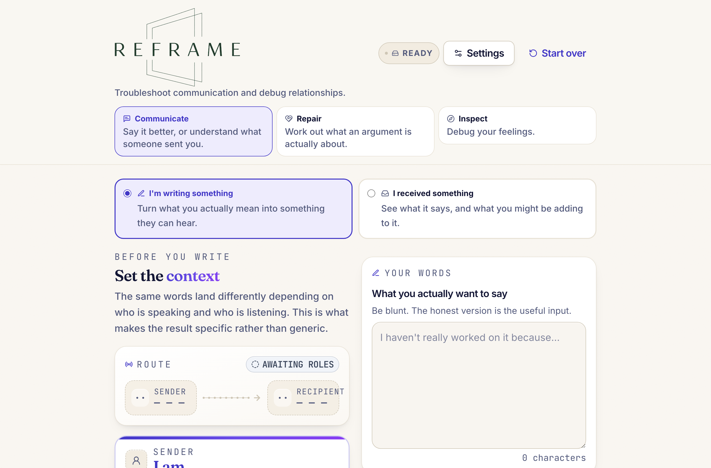
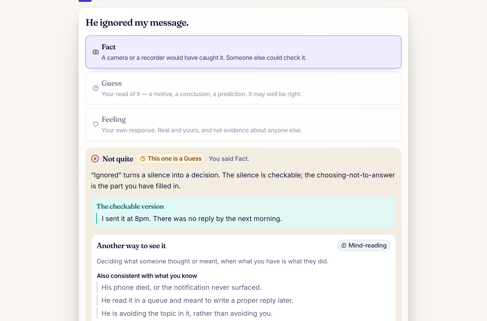
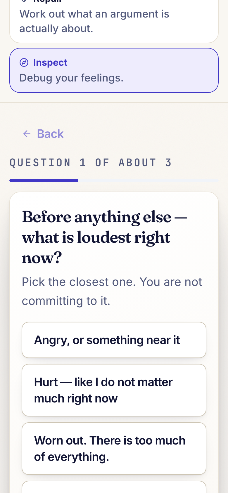

<div align="center">


**Troubleshoot communication and debug relationships.**

[**→ Try it live**](https://apullenb.github.io/hackathon-reframe-app/)

</div>

---

## What this is

Most writing assistants make your words sound better. Reframe tries to make sure they *mean the
right thing to the person receiving them* — and, going the other way, to separate what a message
actually said from what you added to it while reading.

It does not claim to read minds. That is the whole design constraint: every inference it makes is
labelled with how well the evidence supports it, and what *cannot* be known from a message gets
its own section rather than being quietly dropped.



## Why this exists

The application is the artefact. The actual subject of the experiment was **multi-agent
orchestration**: how a manager agent decomposes work across subagents, what contract they have to
share before running concurrently, and how they communicate findings back without diverging.

The pattern that held up:

- **The orchestrator owns the shared surface first.** Type contracts, the Zod validation gate,
  design tokens and the session reducer were written centrally *before* any fan-out. Agents
  cannot diverge on a shape that is already fixed.
- **Disjoint file ownership.** Every agent gets an explicit allowlist. Three result views were
  built concurrently because they share no files — only the frozen contracts and primitives.
- **Interface signatures frozen in the brief.** Consumers and components get written in the same
  pass rather than serially, because both sides are coding against a published API.
- **Report deviations; do not resolve them silently.** An agent that finds the contract wrong
  raises it instead of quietly changing a signature. This is what turned a colour token with no
  owner, and a component that had to be able to render nothing, into questions rather than
  latent defects.
- **Evidence over assertion.** An agent reporting "accessibility verified" is worth less than one
  reporting the measured contrast ratio and the node count. Briefs demanded the measurement.

Across roughly five thousand lines of parallel work, total integration cost was a single type
error, caught at the merge point.

The failure modes were as instructive as the successes. Three agents died mid-run — one machine
sleep, two stream stalls — with their file edits complete but unverified claims left in the log,
which then had to be re-verified by hand; **a dead agent's unfinished report is the most dangerous
artefact in a parallel build, because it is indistinguishable from a finished one.** Two agents
independently patched the same visual bug without noticing they shared a root cause, which only
surfaced when their reports were read together. And several of the most valuable defects were
found *through* agent communication rather than in code review: the agent writing the
documentation discovered that a documented configuration switch controlled nothing, and that the
flagship demo silently skipped one of its own scripted steps — neither reachable by the
typechecker, the linter, or the build, all of which were green throughout.

## What makes it different from a "make this more professional" rewriter

Four things, and they are the product:

**Context is in the request, not the prompt's garnish.** You say who you are, who you are talking
to, the relationship, and the channel. The same blunt sentence becomes a different message for a
product manager on Slack than for an executive over email — because the prompt is built to make
the recipient's role change what gets said first, and the channel change how long and how formal
it is. One instruction in the system prompt states the bar directly: *a message that would work
equally well for any role pair is a failed result.*

**It will not invent facts to make you look better.** If an honest rewrite would need progress,
an approval, or a date you never gave, it asks for that fact instead of writing one for you. A
build gate fails if the worked example's output contains "approved" — the model must not invent
approval it was never told about.

**Evidence is separated from guessing.** Every inference carries a support level — *strongly
supported*, *plausible*, or *speculative* — plus the wording it came from. A reading that claims
certainty it does not have is treated as a defect, not a stylistic choice.

**Unknowns are a feature.** The schema *requires* the "what you cannot know" list to be non-empty.
A response claiming nothing is unknowable is rejected before it reaches the screen.

## The three tabs

| | What it does |
|---|---|
| **Communicate** | Turn what you actually mean into something the other person can hear — or paste something you received and see what it says versus what you might be adding to it. |
| **Repair** | Give it a screenshot or a description of an argument. It maps each side on its own terms, where the temperature rose, and what the disagreement is actually about underneath the surface topic. It never decides who is right. |
| **Inspect** | Guided questions that separate what happened from what you concluded from what you felt — plus a practice exercise below. |

### Inspect: the fact-or-guess exercise

The skill everything else rests on, as something you practise rather than something done for you.
Twenty-four cards, split evenly between work and family situations, sorted into what a camera
would have caught, what you concluded, and what you felt.

Getting one wrong is where the teaching happens:



Each card names the thinking habit at work (mind-reading, catastrophising, fortune-telling),
rewrites the statement into its **checkable** version, offers two or three other explanations the
same evidence allows, and lands on a read that fits all of it. At least one alternative on each
card is deliberately unflattering — a deck where every alternative is generous would just be
talking you out of your own concern, and you would stop trusting it.

Feeling cards are never "corrected". The reframe there surfaces the need underneath rather than
implying the feeling is a distortion.

> It names thinking habits, never people. Nothing here diagnoses anyone, and it is a thinking
> exercise, not therapy.

## Trying it live

**[apullenb.github.io/hackathon-reframe-app](https://apullenb.github.io/hackathon-reframe-app/)**

Read this bit before you judge it, because the hosted version is deliberately limited:

Live AI runs through a **dev-server middleware plugin** that keeps the API key inside a Node
process. GitHub Pages is static — there is no Node process — so on the live site that relay does
not exist. What you get:

- **The three prepared scenarios work fully.** They are real, validated responses and the best way
  to see what the product does in two minutes.
- **Your own text is refused, not faked.** Rather than answering your paragraph with an unrelated
  prepared response, the app says so plainly. That refusal is deliberate; handing back someone
  else's message as though it were your translation is the difference between a demo and a fake.
- **You can supply your own key** in **Settings** to run live on your own text. It goes from your
  browser straight to the provider, and the UI says so.

For live AI without pasting a key anywhere, run it locally.

## Run it locally

Requires Node 20+ (developed on 23.3) and npm.

```bash
git clone git@github.com:apullenb/hackathon-reframe-app.git
```

```bash
npm install
```

```bash
npm run dev
```

That is enough to use everything except live AI on custom text — prepared scenarios need no key
and no configuration at all.

### Adding live AI

```bash
cp .env.example .env
```

Fill in at least one provider, then restart. The startup line tells you what it found:

```
[ai-proxy] dev route ready: providers=openai(gpt-4o) → anthropic(claude-sonnet-5) mode=auto
```

| Variable | Read by | Notes |
|---|---|---|
| `AI_PROVIDER` | Node | Primary provider: `anthropic`, `openai`, or `compatible` |
| `AI_FALLBACK_PROVIDERS` | Node | Ordered chain, e.g. `anthropic,compatible` |
| `AI_MODE` | Node + client | `live` \| `fixture` \| `auto` |
| `ANTHROPIC_API_KEY` / `ANTHROPIC_MODEL` | Node only | |
| `OPENAI_API_KEY` / `OPENAI_MODEL` | Node only | |
| `COMPATIBLE_API_KEY` / `COMPATIBLE_BASE_URL` / `COMPATIBLE_MODEL` | Node only | Any OpenAI-shaped endpoint |

**Never give a key a `VITE_` prefix.** Those are inlined into the browser bundle. `.env` is
gitignored, and the build is checked against a decoy key value to prove nothing leaks.

### Scripts

```bash
npm run typecheck && npm run lint && npm run validate:fixtures && npm run check:functional
```

| Script | What it does |
|---|---|
| `dev` | Vite dev server, including the AI relay |
| `build` | Typecheck, then production build |
| `preview` | Serve the production build |
| `typecheck` / `lint` | `tsc --noEmit` / eslint |
| `validate:fixtures` | 60 schema + content checks on the prepared responses |
| `check:functional` | 53 state-machine, request-building and validation checks |
| `check:live` | Exercises the real provider pipeline |
| `mock:provider` | A local fake provider, so failover can be tested without spending credit |

## Architecture

Vite + React 18 + TypeScript (strict) + Tailwind + Zod. No database, no auth, no persistence, no
message history. Four runtime dependencies.

```
Browser ──POST /api/context-switch──► Vite middleware (key lives here, Node only)
                                          │
                                     provider chain: openai → anthropic → compatible
                                          │
                                     Zod gate: validateResponse(mode, candidate)
                                       │              │
                                    valid          invalid ──► retry once with a repair
                                       │                       instruction, then a typed error
                                     render                    (raw model output is never shown)
```

**One validation gate, no exceptions.** Every response passes `validateResponse()` — live ones and
prepared fixtures alike. A fixture that skipped the gate would hide exactly the bug the gate
exists to catch. The schemas are deliberately stricter than the TypeScript types in three places,
because the original contract allowed responses that would type-check and render nothing.

**Failover is per-cause, not blanket.** The chain advances only when a client genuinely cannot
serve — no client available, or a network failure. A timeout or a schema failure is reported as
itself rather than silently re-run down a slower path, which would double latency on exactly the
failure a live demo is most likely to hit. This earned its keep when one provider account ran out
of credit mid-build and the app kept working without a code change.

**The no-server key approach, and its cost.** The dev-server plugin is the only place a key
exists, and it never reaches the browser bundle. The honest limitation: a statically hosted build
has no Node process, so live AI there requires the user to paste their own key, which does put a
key in the browser — held in memory and `sessionStorage`, never `localStorage`, cleared by Start
over, and confined to one auditable file.

**Style is a runtime layer.** Colour, radius, shadow and gradient live in CSS custom properties
rather than the Tailwind config, so switching among the nine themes is a token swap, not a
rebuild. Colours are stored as `R G B` triplets because the utility layer wraps them in
`rgb(var(--token) / alpha)` — a hex value there silently breaks every opacity modifier.

## On mobile



Every screen is verified at 390px, 768px and 1440px: no horizontal scroll, no element spilling its
bounds, 44px minimum tap targets, and no status conveyed by colour alone.

## Privacy and safety

- With live AI enabled, **your messages are sent to the configured provider.** The app says so
  where you type. It never claims your messages stay on your device, because they do not.
- Nothing is persisted. No message history, no analytics containing message content, no logging of
  keys or message text.
- Nothing is ever sent to anyone on your behalf. There is no send button.
- It does not diagnose people. It will not label anyone as manipulative, narcissistic, or abusive
  from ordinary messages, and it names thinking habits rather than characters.
- It refuses false equivalence. Where messages contain threats, intimidation, coercion or a safety
  concern, the analysis does not flatten that into "both sides should communicate better"; it names
  the observable behaviour and points toward appropriate support.
- It is **not** a therapist, HR representative, attorney, or crisis service, and says so.

## Known limitations

1. **The hosted site cannot do live AI on your own text** without a user-supplied key — see above.
2. **Live output quality is under-verified.** The transport is proven end to end; the prompts have
   had far less adversarial testing than the code.
3. **Multi-speaker conflicts are rejected, not supported.** More than two speakers is reported
   rather than resolved.
4. **The three-way jargon control maps onto a boolean**, so "remove" and "reduce" behave
   identically at the prompt level.
5. **The client timeout covers a request and its repair retry together**, so the retry gets no
   fresh budget.
6. **Bring-your-own-key cannot change the model** — the model setting reaches the server path only.
7. **No component test suite.** Coverage is the two gate scripts plus the AI layer's smoke checks.
8. `spec §` citations throughout the source refer to a design document no longer kept in this repo.

## Verification

What is actually checked, rather than assumed:

| Check | Result |
|---|---|
| Fixture gate | 60 / 60 — schema plus content invariants, negative-tested by injecting a defect and confirming the build goes red |
| Functional gate | 53 / 53 — asserts the role pair and follow-up answers really reach the request payload |
| No key in the bundle | Pass — decoy-value production build, then grep `dist/` for the decoy |
| Text contrast | 0 failures across 443 text nodes, computed from rendered colours |
| Tap targets | 0 under 44px at 375 / 768 / 1440 |
| Provider failover | Proven against a local mock, then observed in production when a provider ran dry |
| Keyboard traversal | Partial — every control is native with an accessible name; a full end-to-end pass was not redone after the last redesign |
| Reduced motion | Structural — one global media block, all animations behind `motion-safe:`; not verified by toggling the OS setting |

The two partial rows are recorded as partial on purpose. A table of unqualified passes would be
less useful than one that says where the evidence stops.

---

<div align="center">
<sub>Built as a hackathon project. It separates what was said, what may have been meant, what was
inferred, and what still needs to be asked — and it does not pretend to do more than that.</sub>
</div>
